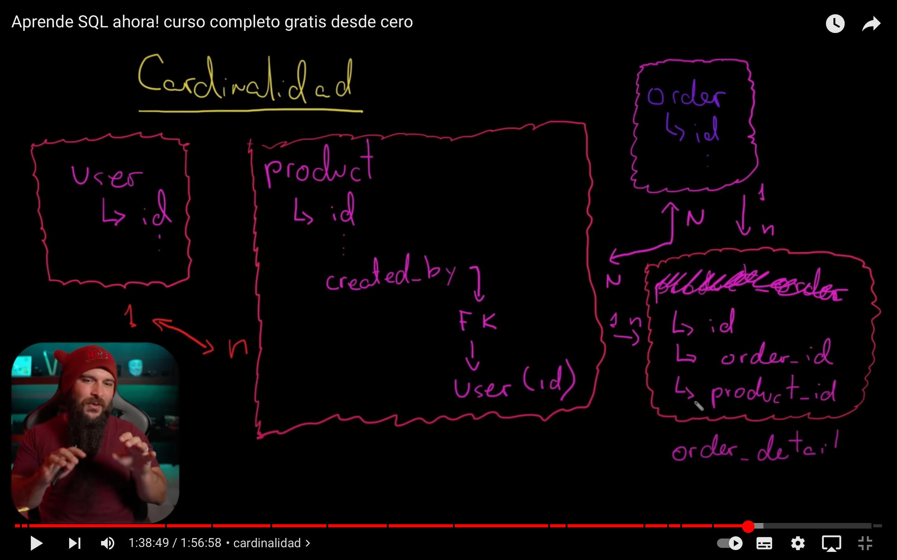

# SQL (Structured Query Language)

*"Databases for stored data"*

Source tutorial: [link](https://www.youtube.com/watch?v=uUdKAYl-F7g "Youtube")

Download mysql: [link](https://dev.mysql.com/downloads/mysql/ "Installation")

Run mysql in mac terminal: [link](https://www.youtube.com/watch?v=ryvNDIX3gQA "Youtube")

> cd /usr/local/mysql/bin/; ls
 
> ./mysql -u root -p    

Import and export the database: [link](https://www.interserver.net/tips/kb/import-export-databases-mysql-command-line/ "website")

* RDBMS (Relational Database Management System): MySQL, PostgreSQL, MariaDB. Backups, import, export, concurrency.
* CRUD (Create, Read, Update, Delete) with Query's.
* Databases types: 
    * SQL: Data structured in tables (PK, FK, rows and columns-records)
    * NO SQL: JSON, BSON, BLOB, Key-Value
* Different relationships types (cardinality): 1 -> n, n -> n, with intermediate tables naming produtc_order  or just order detail as we can see right here.
    * 
    * 
* Normalize tables (by they own entities)
